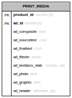
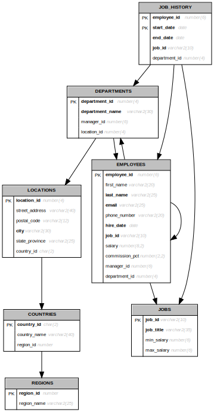
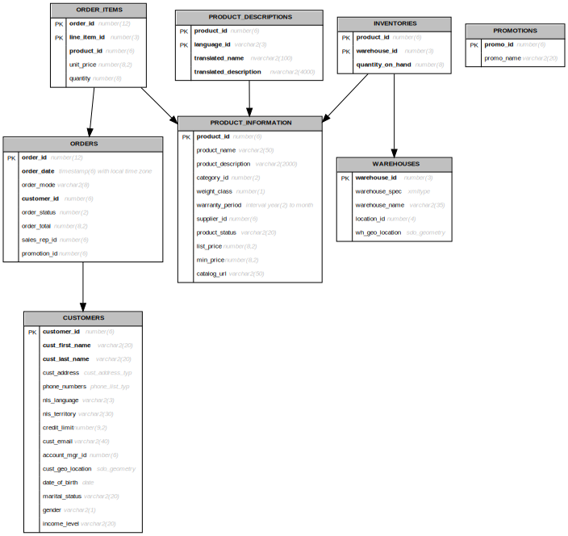
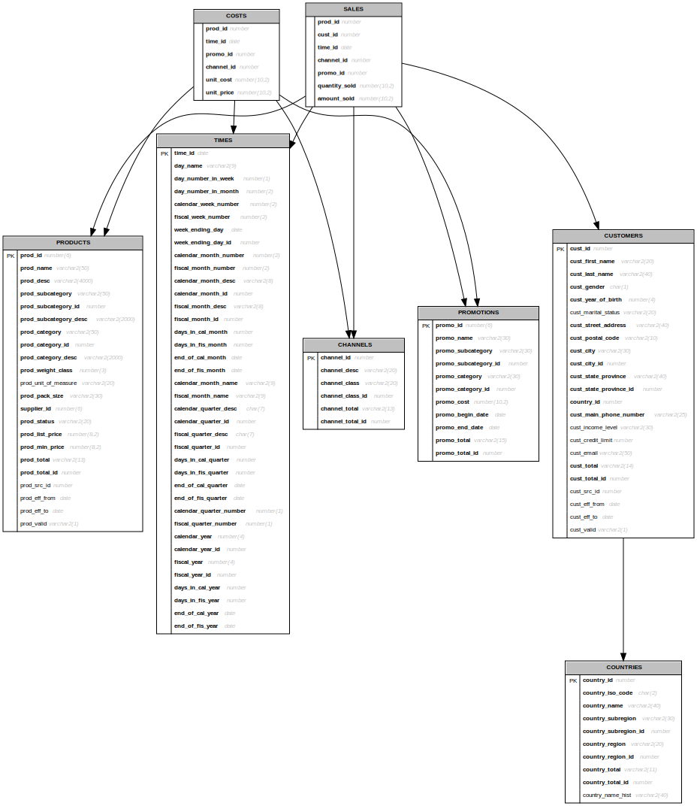
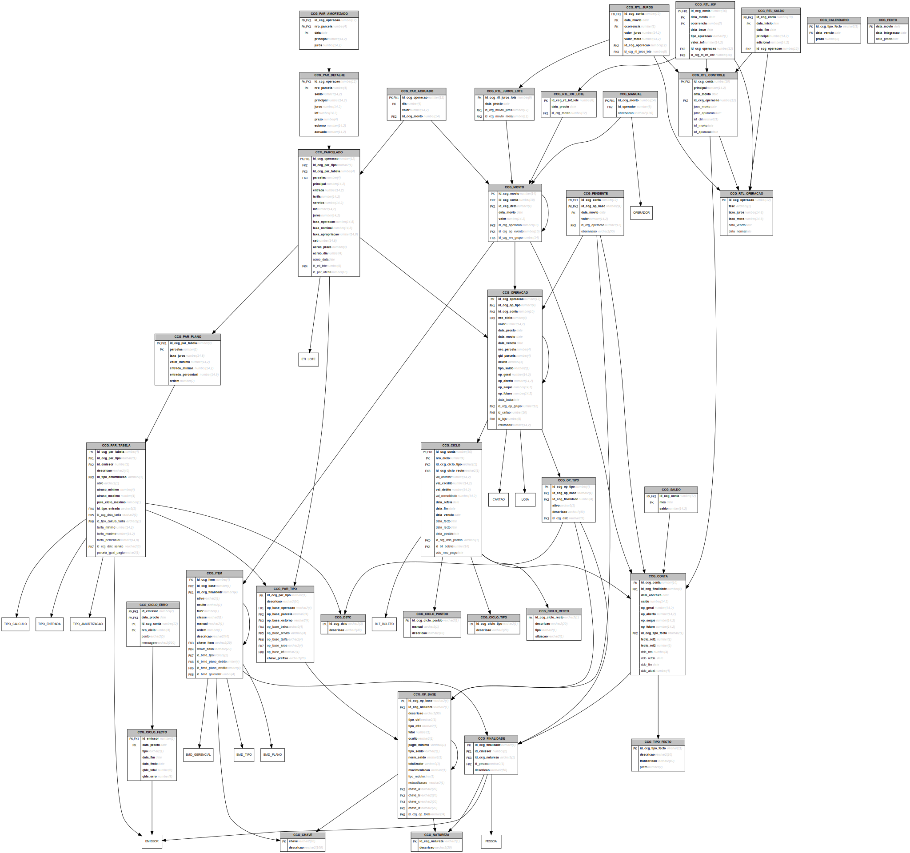
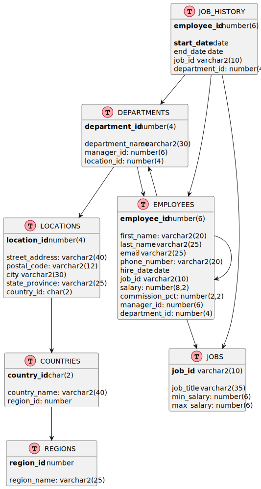

# Oracle Table Diagrams

Create table diagrams for an Oracle Database.

## Implementation

A simple SQL\*Plus script to create table diagrams for an Oracle Database.

- The table information is extracted from Oracle's internal Data Dictionary (USER_TABLES, etc) using regular SQL queries
- An intermediary script (graphviz or plantuml) is generated
- The GraphViz or PlantUML tool is called to generate the final diagram in SVG format (see some examples below)

## Requirements

To generate the diagrams, you must have installed on your system one or both of the following

- [GraphViz](https://graphviz.org/download/) to use `tabgraph`
- [PlantUML](https://plantuml.com/download) to use `tabuml`

## Installation

- Set the `SQLPATH` environment variable to a directory where you keep your custom scripts if you haven't already
- Copy `tabgraph.sql` and `tabuml.sql` to that directory
- Edit the scripts to point to the location of your GraphViz/PlantUML installation
- Make a `C:\Temp\` directory or change the scripts to point to your custom temp directory where the intermiary script and final SVG diagram will be generated.
  
## Usage

> Replace `tabgraph` with `tabuml` to generate diagrams using PlantUML.

At the SQL\*Plus prompt (`SQL>`) and logged in to the user that owns the tables, use:

```
SQL> @tabgraph REGULAR_EXPRESSION
```

Notice `tabgraph` uses regular expressions to filter the table names.

To generate diagrams for a single table named `employees`:

```
SQL> @tabgraph ^employees$
```

For all the tables that end in `ns`

```
SQL> @tabgraph ns$
```

For all the tables that begin with `job`

```
SQL> @tabgraph ^job
```

For all the tables in the user schema (**warning:** may be slow with hundreds of tables, filtering is preferable!)

```
SQL> @tabgraph .
```

## Examples

A few examples diagrams generated from the [Oracle Database sample schemas](https://github.com/oracle-samples/db-sample-schemas).

<details>

  <summary>Diagrams generated with tabgraph + GraphViz </summary>

  

  

  

  

  

</details>

<details>

  <summary>Diagrams generated with tabuml + PlantUML</summary>

  

</details>


## Alternatives

This is a **very simple** script to produce diagrams for a **quick reference**.

For a more robust, professional looking solution, you may try some alternatives:
- [SchemaSpy](http://schemaspy.sourceforge.net/): free and open source
- [SchemaCrawler](https://www.schemacrawler.com/): free and open source
- [Dataedo](https://dataedo.com/): paid product (there is a free trial)
